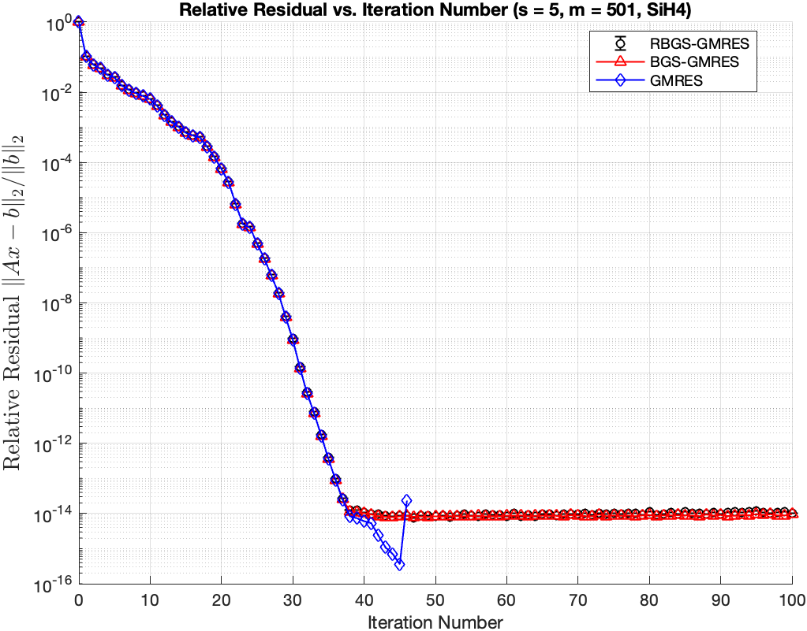
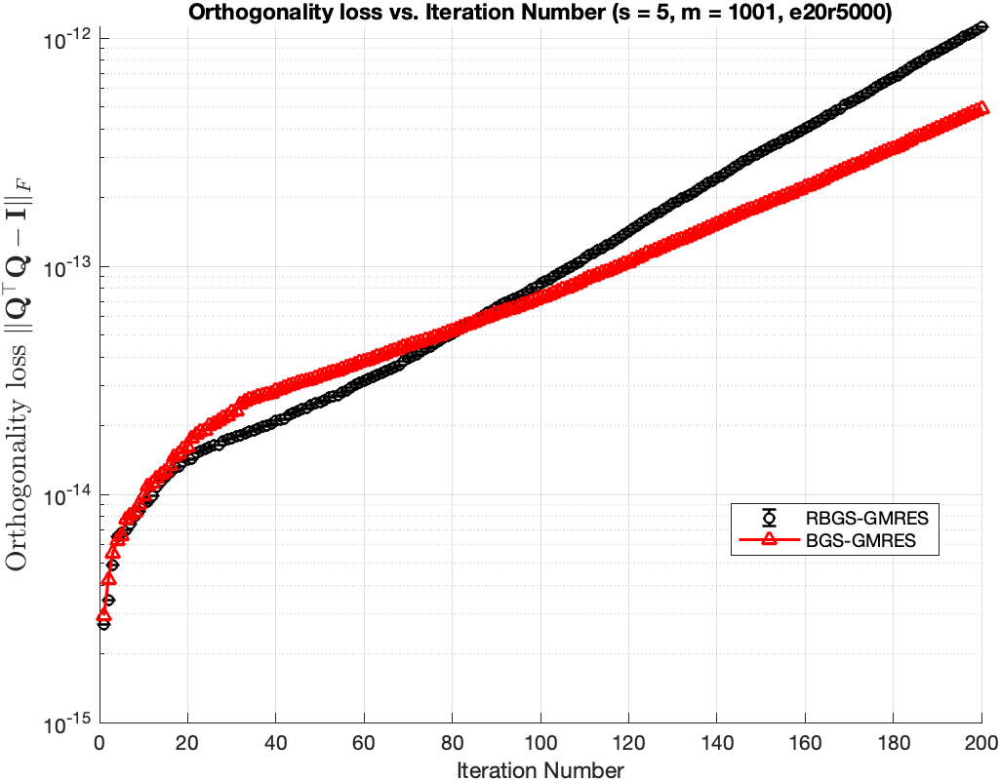
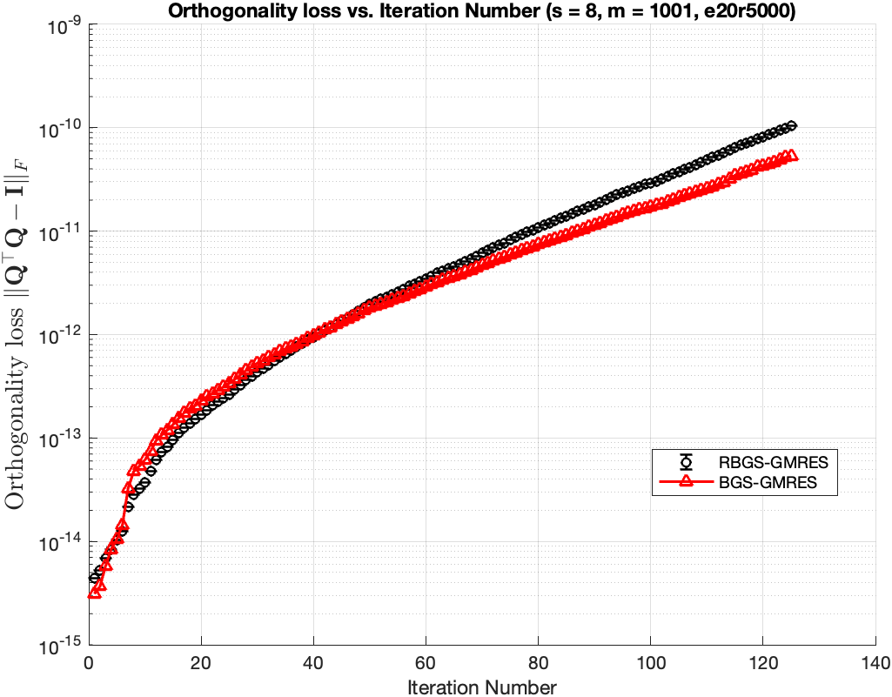

# Notes – October 14, 2025
 
**Topic:** Discussion on Experimental Results of RBGS_GMRES, BGS_GMRES and built-in GMRES  

---

## 1. Overview of Experiment Setup

| Parameter | Description |
|------------|-------------|
| Solver | RBGS-GMRES, BGS-GMRES, GMRES(built-in)|
| Runs | 1 |
| Matrices Tested | SiH4, Si10H16, e20r5000
|Krylov basis| monomial basis, Newton basis (SiH4, e20r5000)
| Sketch Sizes | s = 5, 8, 10, 20|
| Metric | Relative residual, $ \left\lVert A*x - b \right\rVert / \left\lVert b \right\rVert$ |

---

## 2. Experimental Results by Matrix

---

### 2.1 SiH4 

**Matrix info:** \( n = 5041\)  
**condition number:** \( 1.065536e+03 \)  
**Sketch info:** \( m = 501, d = 2 * m \)  
**Converge info:** \( ctol = 1e-16 \)  
**Krylov basis:** \( monomial basis and newton basis \)

#### ➤ Results for Step Sizes

**relative residual (after reorthogonalization)**
- s=5   | Newton basis  
- s=10   | Newton basis  
- s=20   | Newton basis  

### 2.2 Si10H16

**Matrix info:** \( n = 17077 \)    
**Condition number:** \( 5.633416e+04 \)     
**Sketch info:** \( m = 1001, d = 2 * m \)   
**Converge info:** \( ctol = 1e-16 \)
**Krylov basis:** monomial basis

#### ➤ Results for Step Sizes

**relative residual (after reorthogonalization)**
- s=5  
- s=8  
- s=10  
- s=20  

### 2.3 e20r5000 - tested in Adaptive s-step GMRES with randomized and truncated low-synchronization orthogonalization

**Matrix info:** \( n = 4241 \)    
**Condition number:** \( 4.44e+10 \)     
**Sketch info:** \( m = 1001, d = 2 * m \)   
**Converge info:** \( ctol = 1e-16 \)

#### ➤ Results for Step Sizes

**relative residual (after reorthogonalization)**
- s=5  
#### ➤ Results in the paper, s=5, monomial basis

- s=8  
- s=10  
- s=20  

