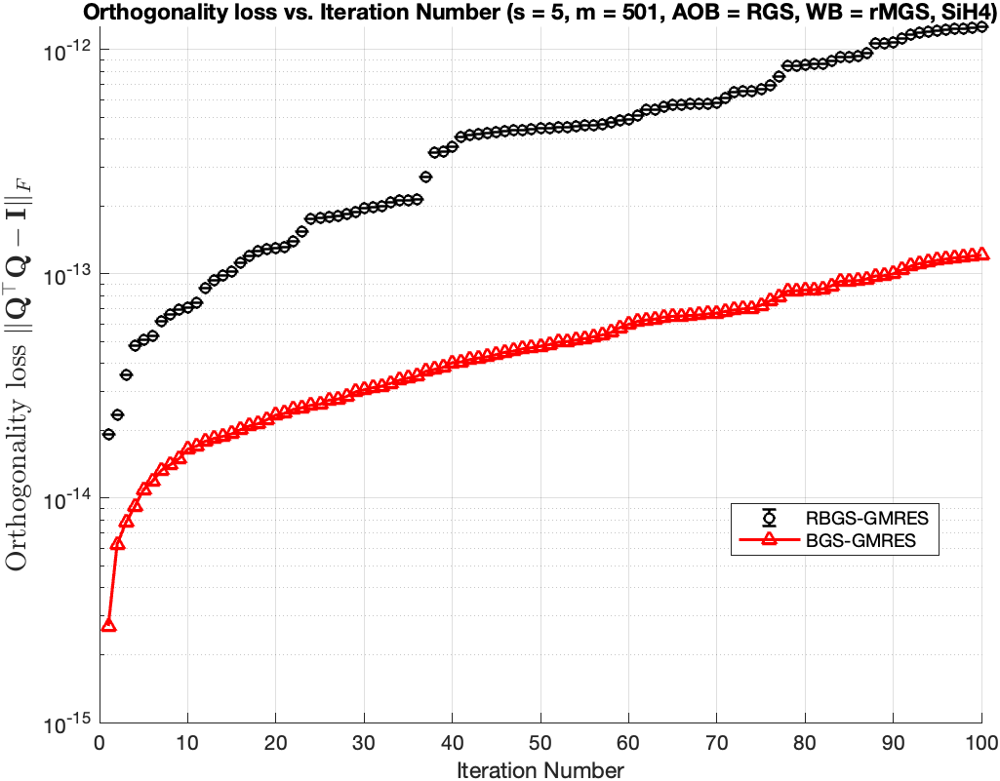
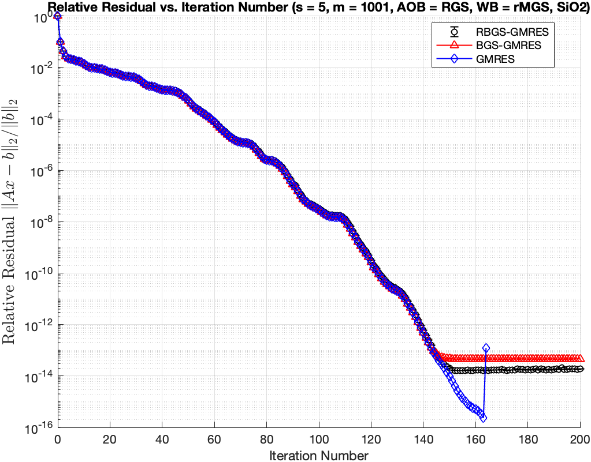

# Notes – October 23, 2025
 
**Topic:** Discussion on Experimental Results of different orthogonalization methods

---

## 1. Overview of Experiment Setup

| Parameter | Description |
|------------|-------------|
| Solver | RBGS-GMRES, BGS-GMRES, GMRES(built-in)|
| Runs | 1 |
| Matrices Tested | SiH4, SiO2
|Krylov basis| Newton basis 
|Orthogonalization of RBGS against other blocks| rCGS, RGS, rMGS
|Orthogonalization of RBGS within a block| rCGS, rCGS2, RGS, rMGS, rWhitening
|Orthogonalization of BGS against other blocks| CGS2
|Orthogonalization of BGS within a block| Whitening2
| Sketch Sizes | s = 5|
| Metric | Relative residual, $ \left\lVert A*x - b \right\rVert / \left\lVert b \right\rVert$ |
| Orthogonalization of RBGS in 10.14 .md | AOB: RGS2, WB: rWhitening2

---

## 2. Experimental Results by Matrix

---

### 2.1 SiH4 

**Matrix info:** \( n = 5041 \)  
**condition number:** \( 1.065536e+03 \)
**step size** \( s = 5 \)  
**Sketch info:** \( Gaussian, m = 501, d = 2 * m \)  
**Converge info:** \( ctol = 1e-16 \)  
**Krylov basis:** \( newton basis \)

#### ➤ Results for Step Sizes

**relative residual and orthogonality**
- AOB = rCGS2, WB = rWhitening  

- AOB = RGS, WB = rWhitening  

- AOB = rCGS, WB = rWhitening  

- AOB = rMGS, WB = rWhitening  

- AOB = RGS, WB = rCGS2  

- AOB = RGS, WB = RGS  

- AOB = RGS, WB = rMGS  

**Discussion**
- RGS is most stable RGS is most stable when orthogonalizing against other blocks.
- When RGS is fixed in AOB, the choice of method in WB is relatively insignificant

### 2.2 SiO2 

**Matrix info:** \( n = 155331 \) 
**step size** \( s = 5 \)  
**Sketch info:** \( CountSketch, m = 1001, d = 2 * m \)  
**Converge info:** \( ctol = 1e-16 \)  
**Krylov basis:** \( newton basis \)

#### ➤ Results for Step Sizes

**relative residual and orthogonality**
- AOB = RGS, WB = rWhitening  

- AOB = rCGS, WB = rWhitening  

- AOB = rMGS, WB = rWhitening  

- AOB = RGS, WB = rCGS2  

- AOB = RGS, WB = RGS  

- AOB = RGS, WB = rMGS  