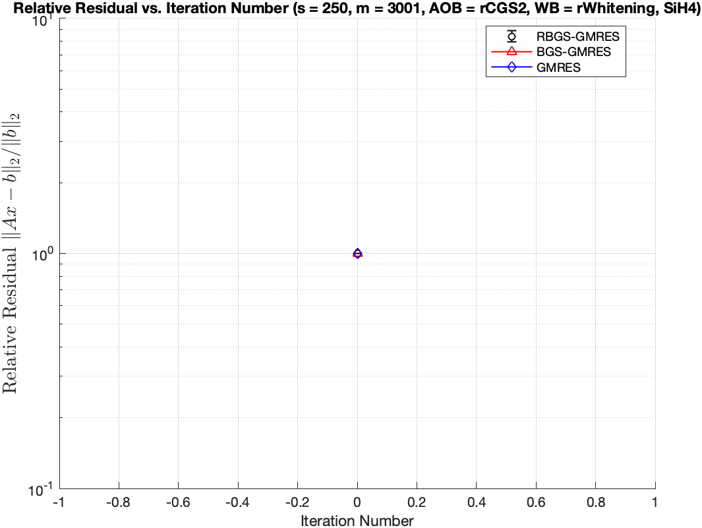

# Notes – October 28, 2025
 
**Topic:** Discussion on Experimental Results of different orthogonalization methods

---

## 1. Overview of Experiment Setup

| Parameter | Description |
|------------|-------------|
| Solver | RBGS-GMRES, BGS-GMRES, GMRES(built-in)|
| Runs | 1 |
| Matrices Tested | SiH4
|Krylov basis| Newton basis 
|Orthogonalization of RBGS against other blocks| rCGS, rCGS2, RGS, rMGS
|Orthogonalization of RBGS within a block| rCGS, rCGS2, RGS, rMGS, rWhitening
|Orthogonalization of BGS against other blocks| CGS2
|Orthogonalization of BGS within a block| Whitening2
| Sketch Sizes | s = 5|
| Metric | Relative residual, $ \left\lVert A*x - b \right\rVert / \left\lVert b \right\rVert$ |
| Orthogonalization of RBGS in 10.14 .md | AOB: RGS2, WB: rWhitening2

---

## 2. Experimental Results by Matrix

---

### 2.1 SiH4 

**Matrix info:** \( n = 5041 \)  
**condition number:** \( 1.065536e+03 \)
**step size** \( s = 5 \)  
**Sketch info:** \( Gaussian, m = 501, d = 2 * m \)  
**Converge info:** \( ctol = 1e-16 \)  
**Krylov basis:** \( newton basis \)

#### ➤ Results for Step Sizes

**relative residual and orthogonality**
- AOB = rCGS2, WB = rWhitening, s = 5, m = 501  

- AOB = rCGS2, WB = rWhitening, s = 50, m = 1001  

- AOB = rCGS2, WB = rWhitening, s = 50, m = 3001  

- AOB = rCGS2, WB = rWhitening, s = 100, m = 3001  

- AOB = rCGS2, WB = rWhitening, s = 150, m = 3001  

- AOB = rCGS2, WB = rWhitening, s = 200, m = 3001  

- AOB = rCGS2, WB = rWhitening, s = 250, m = 3001  

- AOB = rCGS2, WB = rWhitening 

**Discussion**
- The selection of \( s \) depends on the performance aspect to be optimized.  
For achieving a **minimal relative residual** (e.g., ≤ $ 1e-8 $), $ s \leq 20 $ is appropriate,  
whereas for **avoiding communication**, the **optimal range** of $ s $ is likely between **100 and 240**.