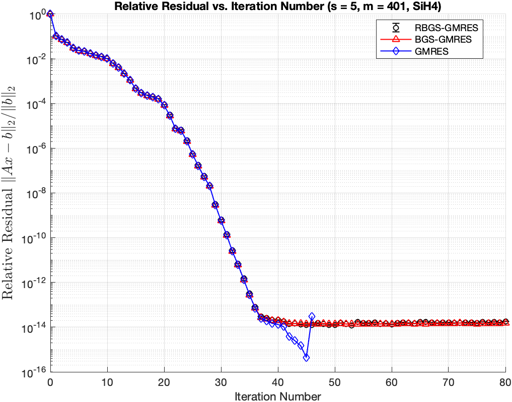
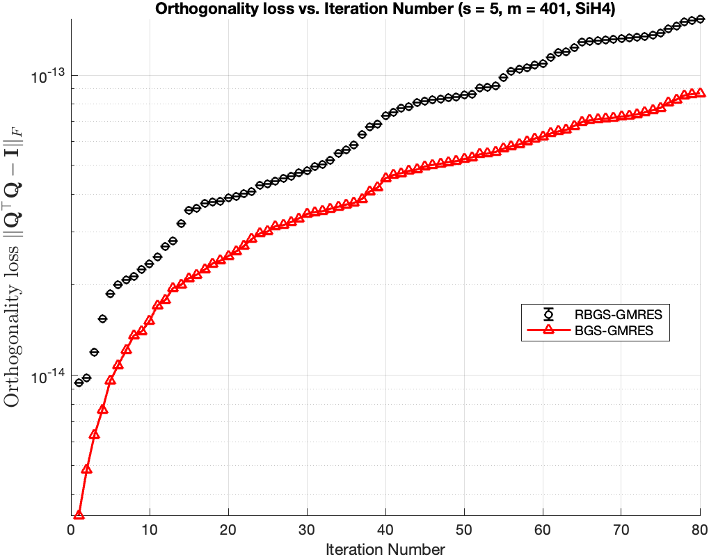
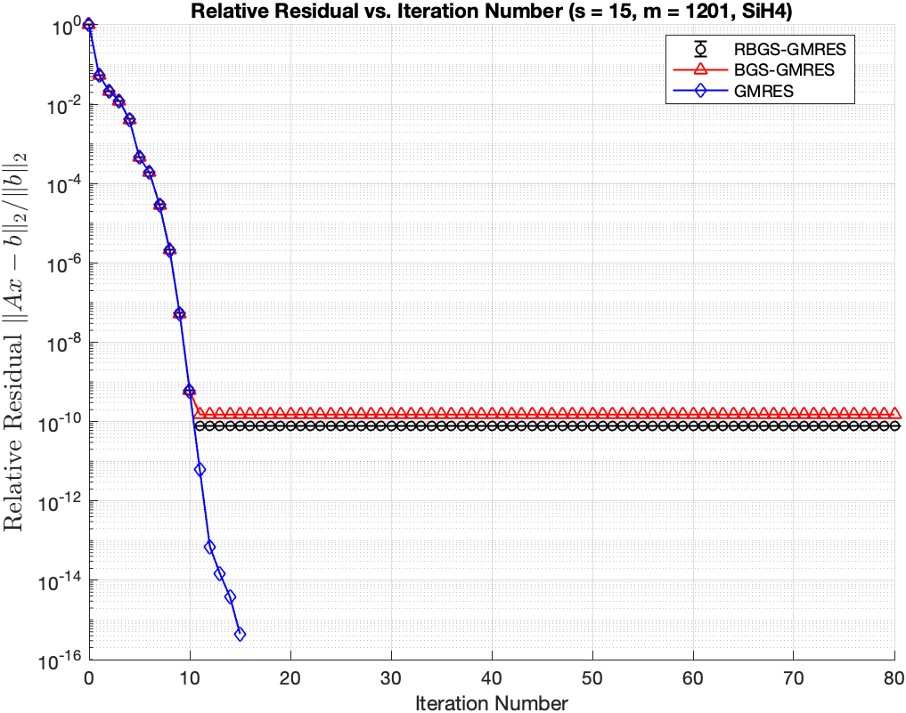
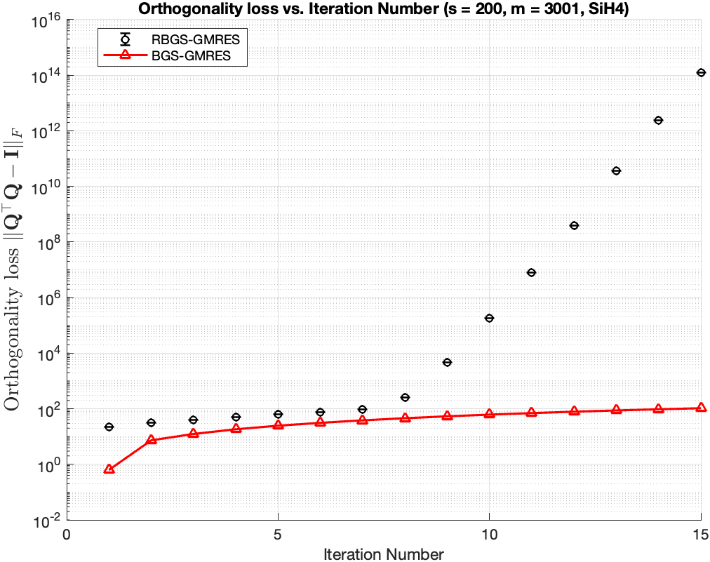

# Notes – October 28, 2025
 
**Topic:** Discussion on Experimental Results of different orthogonalization methods

---

## 1. Overview of Experiment Setup

| Parameter | Description |
|------------|-------------|
| Solver | RBGS-GMRES, BGS-GMRES, GMRES(built-in)|
| Runs | 1 |
| Matrices Tested | SiH4, laeuchli
|Krylov basis| Newton basis 
|Orthogonalization of RBGS against other blocks| rCGS, rCGS2, RGS, rMGS
|Orthogonalization of RBGS within a block| rCGS, rCGS2, RGS, rMGS, rWhitening
|Orthogonalization of BGS against other blocks| CGS2
|Orthogonalization of BGS within a block| Whitening2
| Metric | Relative residual, $ \left\lVert A*x - b \right\rVert / \left\lVert b \right\rVert$ |
| Orthogonalization of RBGS in 10.14 .md | AOB: RGS2, WB: rWhitening2

---

## 2. Experimental Results by Matrix

---

### 2.1 SiH4 

**Matrix info:** \( n = 5041 \)  
**condition number:** \( 1.065536e+03 \)
**Sketch info:** \( Countsketch, m = 501, d = 2 * m \)  
**Converge info:** \( ctol = 1e-16 \)  
**Krylov basis:** \( newton basis \)

#### ➤ Results for Step Sizes

**Minimum Residual vs. s**
- AOB = rCGS2, WB = rWhitening 

**Discussion**
- The selection of \( s \) depends on the performance aspect to be optimized.  
For achieving a **minimal relative residual** (e.g., ≤ $ 1e-8 $), $ s \leq 20 $ is appropriate,  
whereas for **avoiding communication**, the **optimal range** of $ s $ is likely between **100 and 240**.
- It shows an order of magnitude difference in the minimum relative residual between RBGS and RGS when s is large enough

**relative residual and orthogonality for different orthogonal methods when s=5**
 

 

 

 

 

 

 

 

 

 

### 2.1 Laeuchli 

**Matrix info:** \( n = 5000 \)  
**condition number:** \( 5e+05 \) 
**Sketch info:** \( CountSketch, m = 501, d = 2 * m \)  
**Converge info:** \( ctol = 1e-16 \)  
**Krylov basis:** \( newton basis \)

#### ➤ Results for Step Sizes

<!--**Minimum Residual vs. s**
- AOB = rCGS2, WB = rWhitening -->

**relative residual and orthogonality for different orthogonal methods**
 

 

 

 

 

 

 

 

 