# Notes – November 11, 2025
 
**Topic:** Discussion on Experimental Results of different orthogonalization methods

---

## 1. Overview of Experiment Setup

| Parameter | Description |
|------------|-------------|
| Solver | RBGS-GMRES, BGS-GMRES, GMRES(built-in)|
| Runs | 1 |
| Matrices Tested | SiO2, SiH4, Si10H16, genMatrix(1e-3)
|Krylov basis| Newton basis 
|Orthogonalization of RBGS against other blocks| rCGS, rCGS2, RGS, rMGS
|Orthogonalization of RBGS within a block| rCGS, rCGS2, RGS, rMGS, rWhitening
| Metric | Relative residual, $ \left\lVert A*x - b \right\rVert / \left\lVert b \right\rVert$ |

---

## 2. Experimental Results by Matrix

---

#### ➤ Orthogonalization methods for AOB and WB

###  SiO2 
**Matrix info:** \( n = 155331 \) 
**step size** \( s = 5:5:50 \)  
**Sketch info:** \( CountSketch, m ≈ 1001, d = 2 * m \) 
**AOB for RBGS and BGS:** \( RGS, CGS\) 
**WB for RBGS and BGS:** \( rCGS2, CGS2\) 
**Converge info:** \( ctol = 1e-16 \)  
**Krylov basis:** \( newton basis \)

- When AOB in BGS is replaced by CGS, RBGS achieves better performance:
When using AOB = RGS, WB = rCGS2 for RBGS and AOB = CGS, WB = CGS2 for BGS, we can get better performance of RBGS with respect to Relative Residual, whcich corresponds to the results in Laura's papper

|        |        |
|--------|--------|
| s = 5 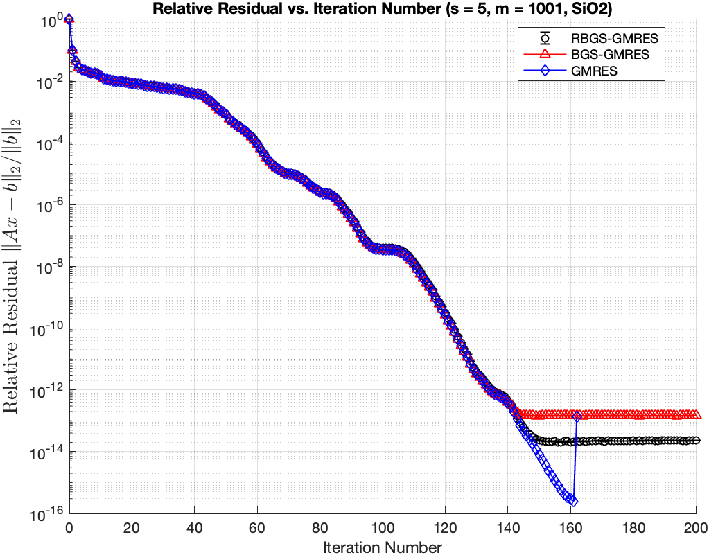 | 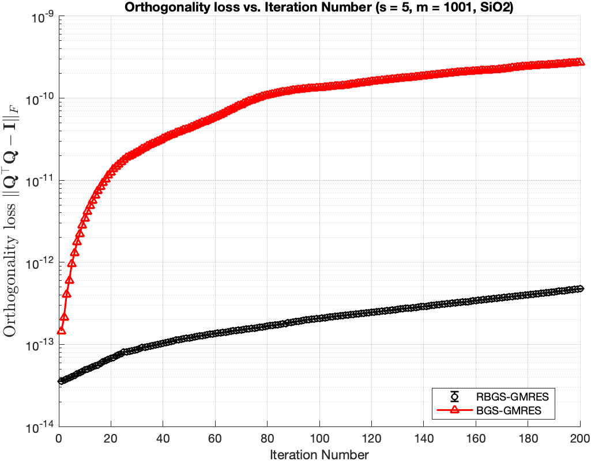 |
| s = 10  | 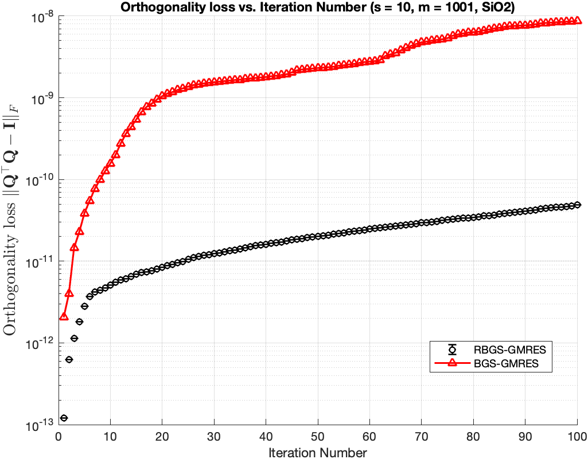 |
| s = 20 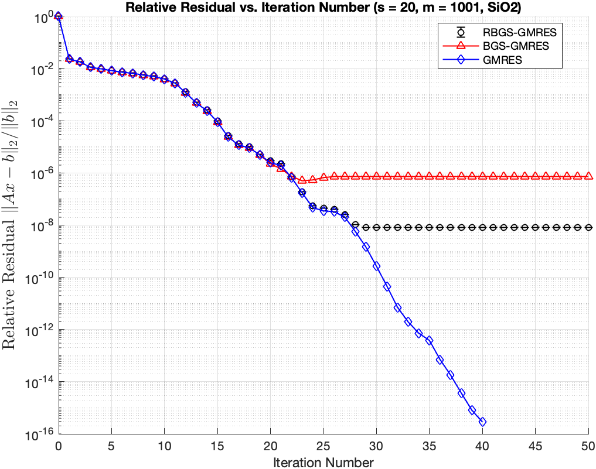 | 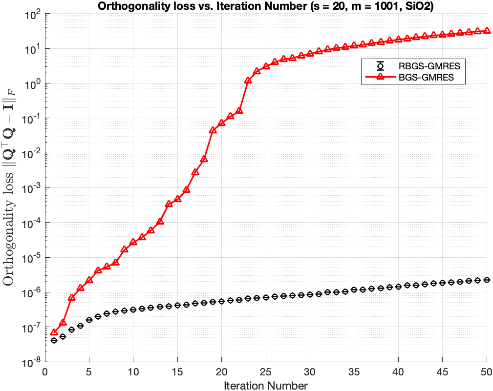 |
| s = 30 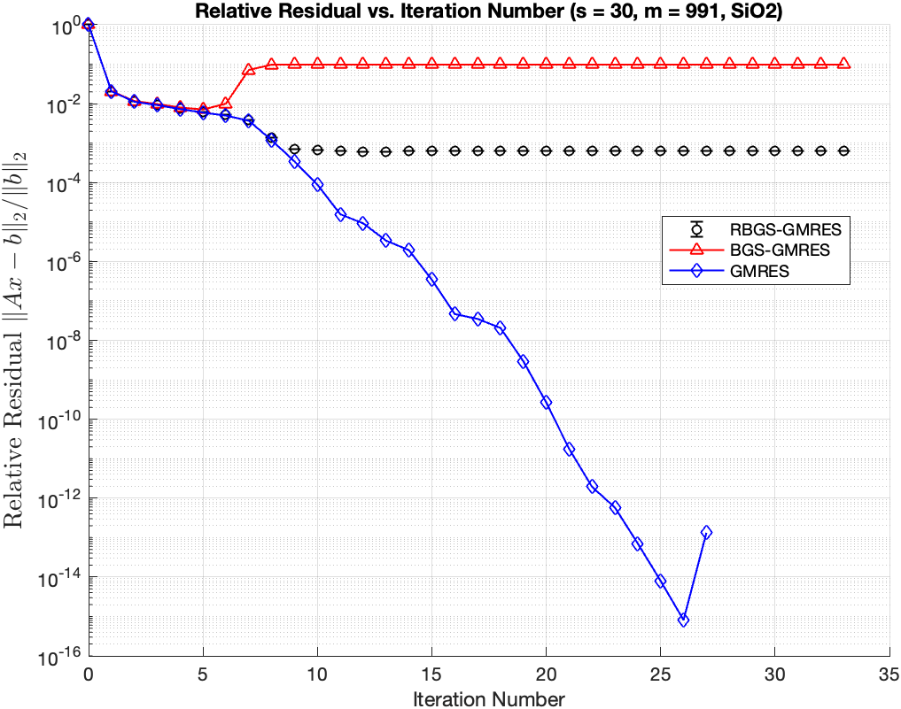 | 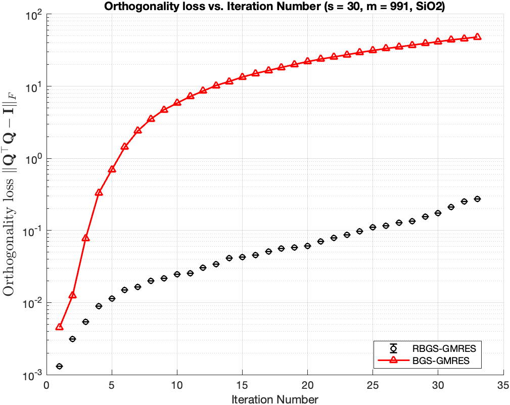 |
| s = 40 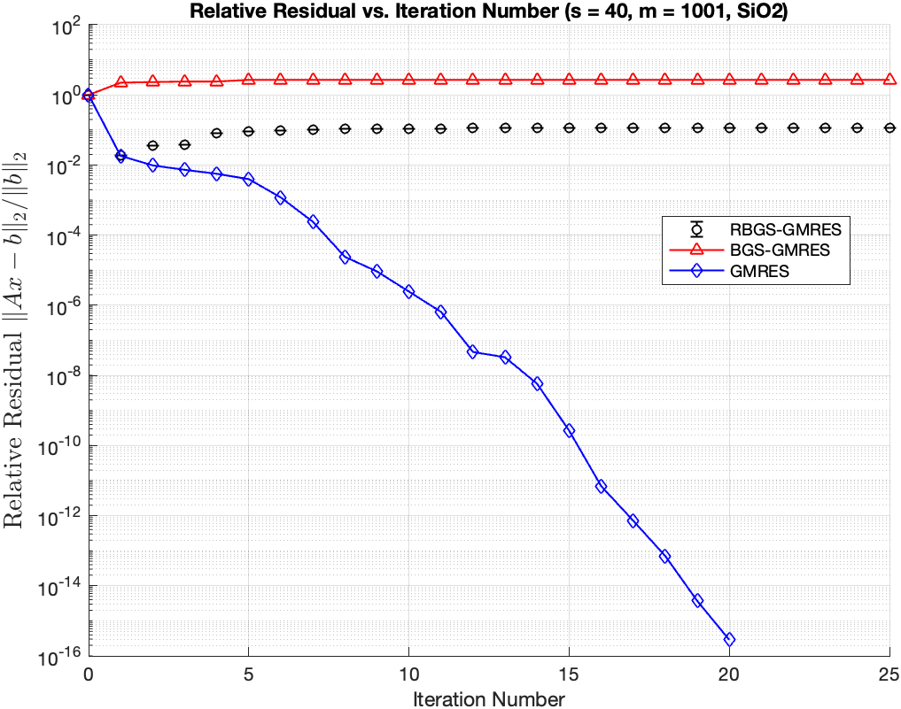 | 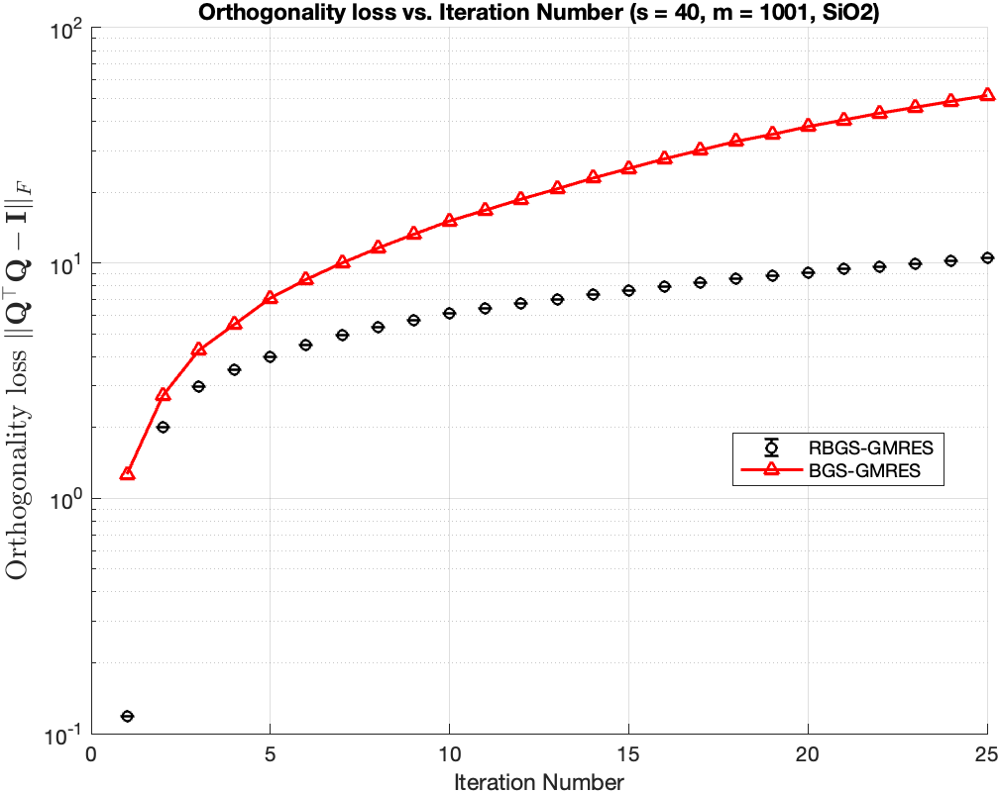 |
| s = 50 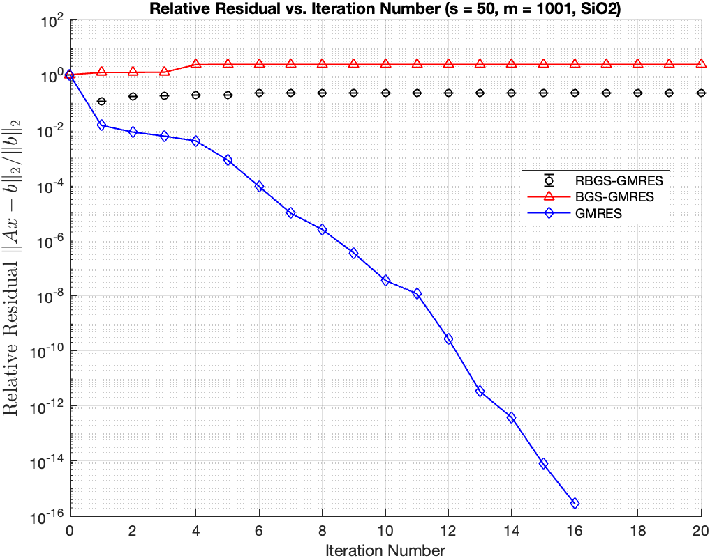 | 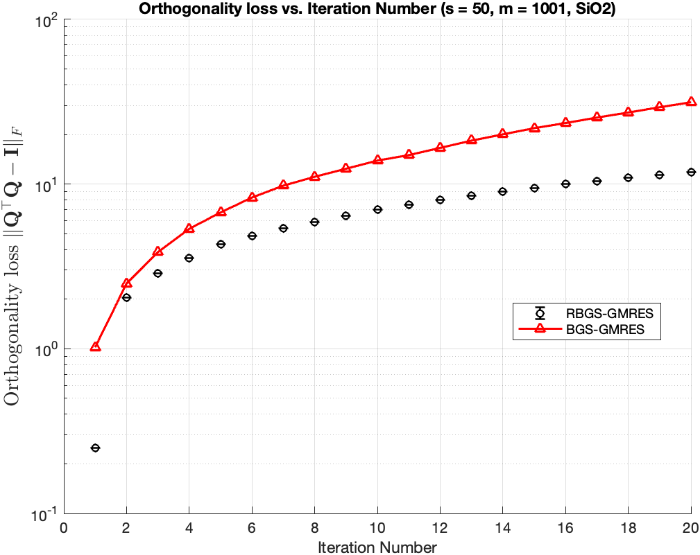 |

**Minimum residual achieved by RBGS and BGS for SiO2 (AOB = RGS/CGS, WB = rCGS2/CGS2, m ≈ 1001, d = 2 * m)**

### 2.2 SiH4
**Matrix info:** \( n = 5041 \)  
**condition number:** \( 1.065536e+03 \)
**Sketch info:** \( Countsketch, m = 501, d = 2 * m \)  
**Converge info:** \( ctol = 1e-16 \)  
**Krylov basis:** \( newton basis \)

#### ➤ Orthogonalization methods for AOB and WB

### 2.3 Si10H16
**Matrix info:** \( n = 17077 \)  
**condition number:** \( 5.633416e+04 \)
**Sketch info:** \( Countsketch, m = 1001, d = 2 * m \)  
**Converge info:** \( ctol = 1e-16 \)  
**Krylov basis:** \( newton basis \)

### 2.3 genMatrix(1e-3)
**Matrix info:** \( n = 2500 \)  
**condition number:** \( 1e+03 \)
**Sketch info:** \( Countsketch, m = 901, d = 2 * m \)  
**Converge info:** \( ctol = 1e-16 \)  
**Krylov basis:** \( newton basis \)
n = 2500;
alpha = 0.5;
matrix = getStartMatrix(n, alpha);

