# Notes – December 9, 2025
 
**Topic:** Discussion on Experimental Results of different orthogonalization methods

## 1. Overview of Experiment Setup

| Parameter | Description |
|------------|-------------|
| Solver | RBGS-GMRES, BGS-GMRES|
| Matrices Tested | SiH4, Si10H16, genMatrix(1e3), SiO2
| Sketch info | SparseSign
|Krylov basis| Newton basis, MonCaveatomial basis
| Metric | Relative residual, $ \left\lVert A*x - b \right\rVert / \left\lVert b \right\rVert$ |

---

## 2. Experimental Results by Matrix

---

### 2.1 SiH4
**Matrix info:** \( n = 5041, m ≈ 501 \)  
**condition number:** \( 1.065536e+03 \).              
**Converge info:** \( ctol = 1e-16 \)    
**Run** \( runs=20 \)

#### ➤ Same RHS b, only differ in the sketch matrices

- newton basis for BGS
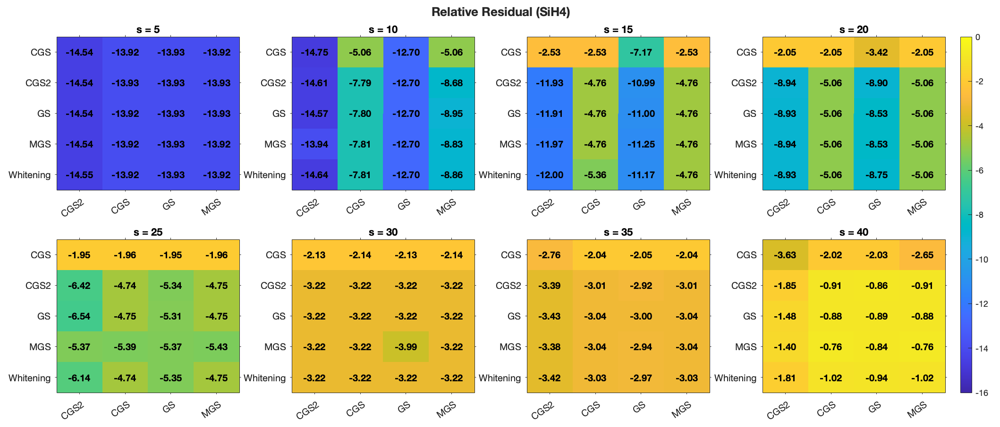
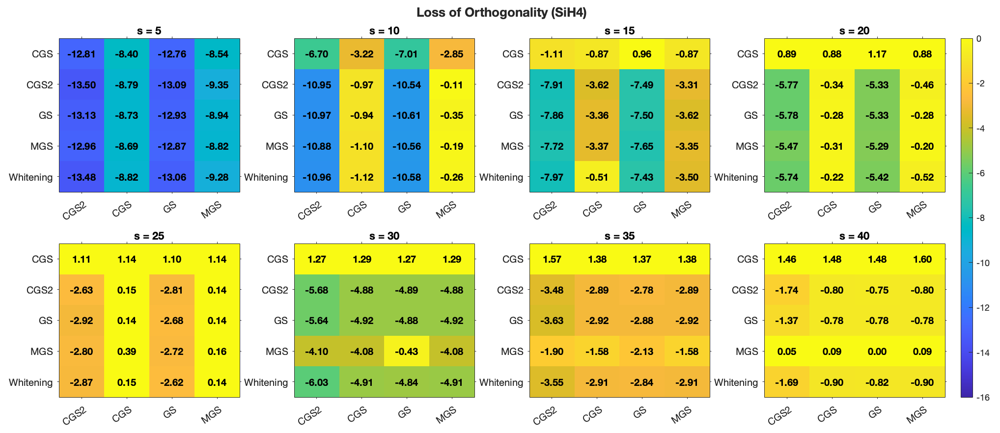  

- newton for RBGS
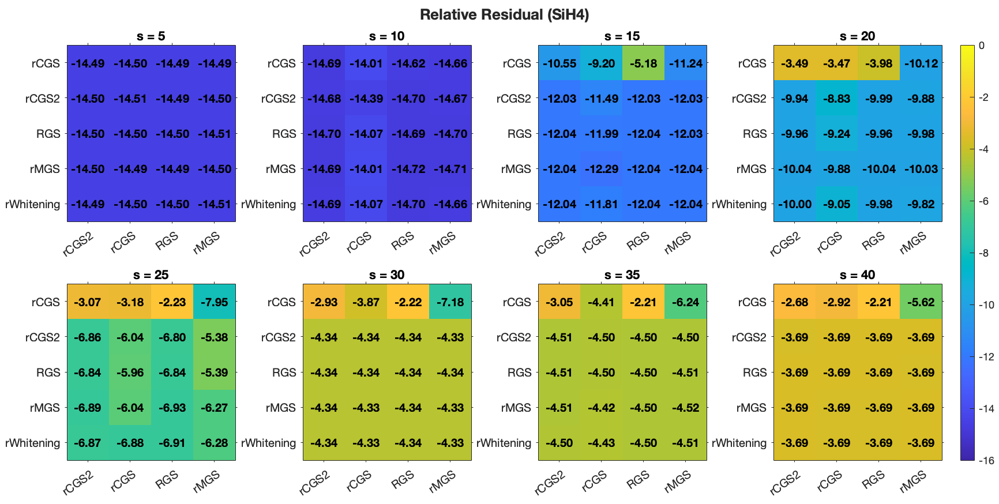  
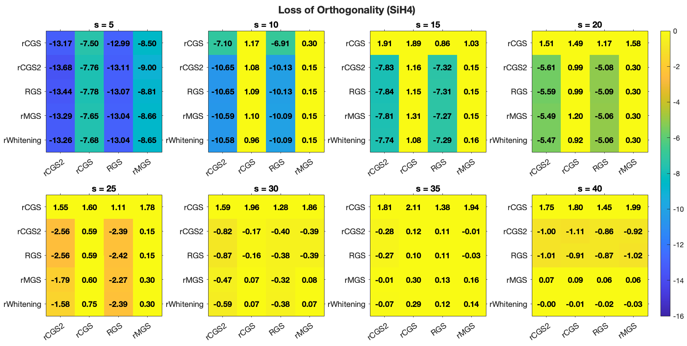  

- monomial for RBGS
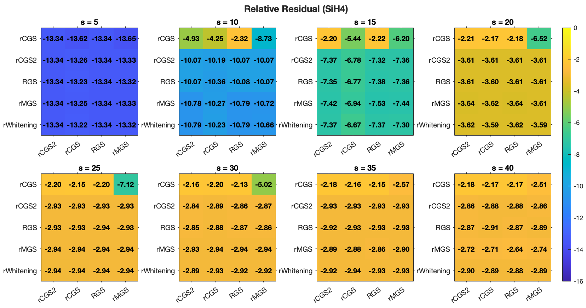  
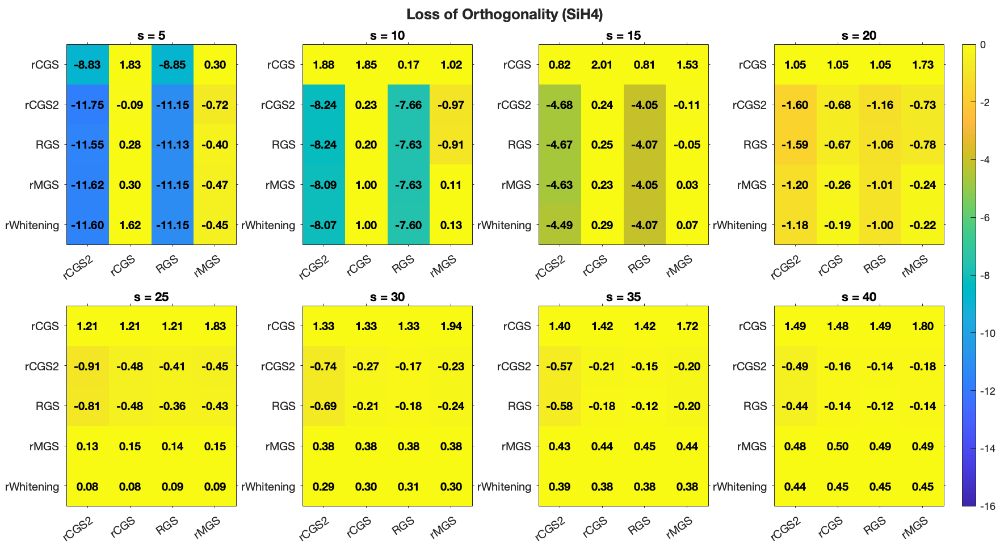  
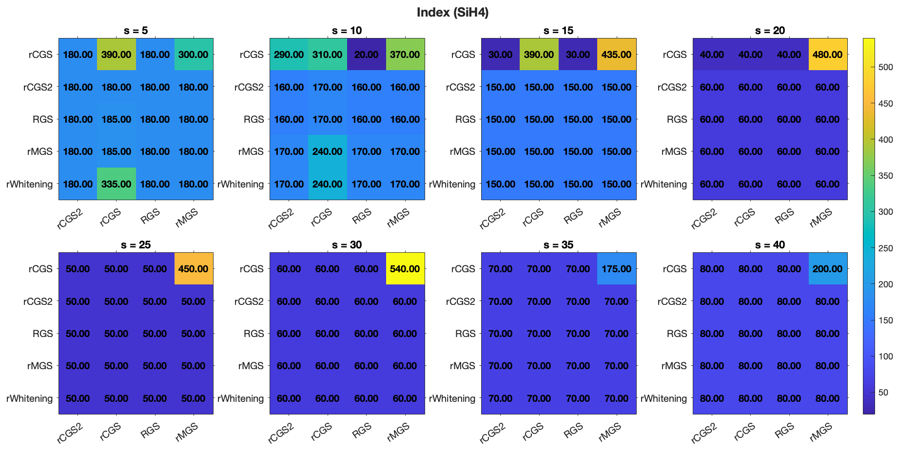

#### ➤ Compare RBGS and BGS when s = 10, run = 20

|  |  |
|------------|-------------|
| 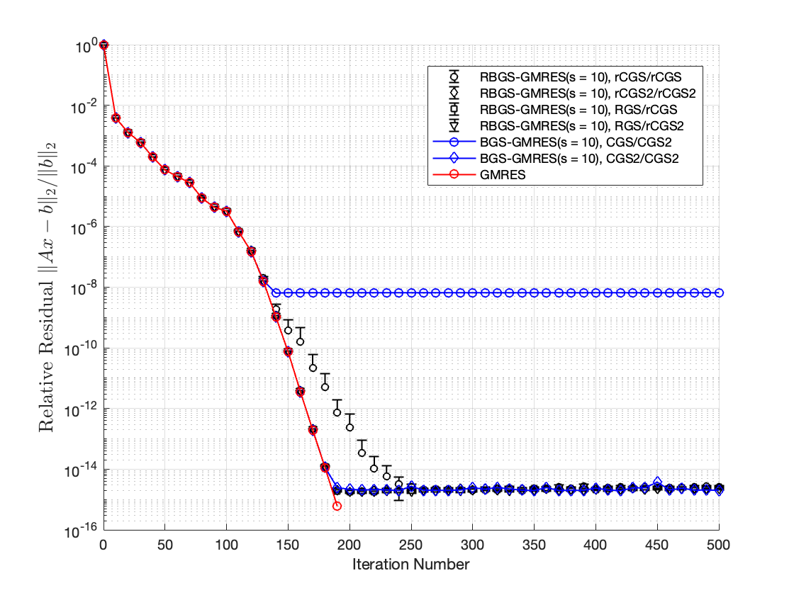 | 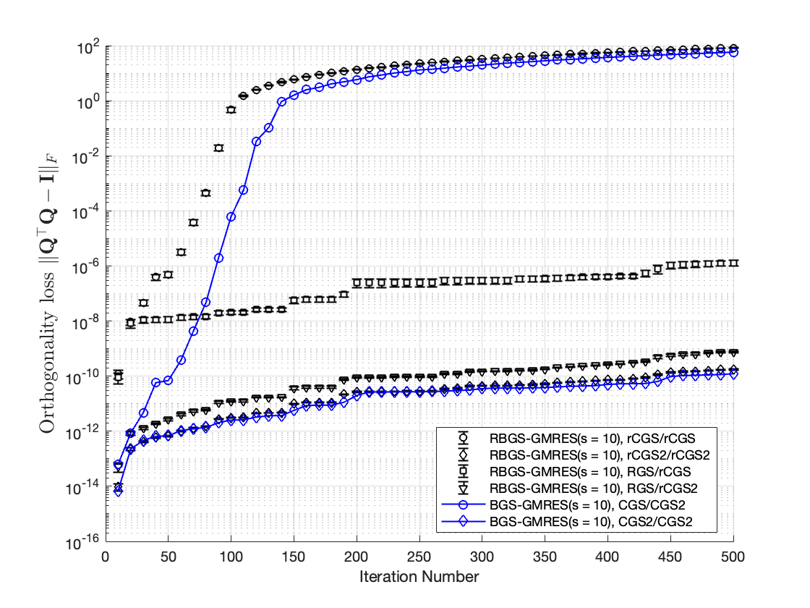 |

**Discussion**.   
- With respect to the relative residual, BGS fails to attain the same level of accuracy as RBGS when less stable orthogonalization schemes are employed. 
- However, the orthogonality loss is directly related to the stability of orthogonalization combination.

#### ➤ Comparison of run times, s = 10
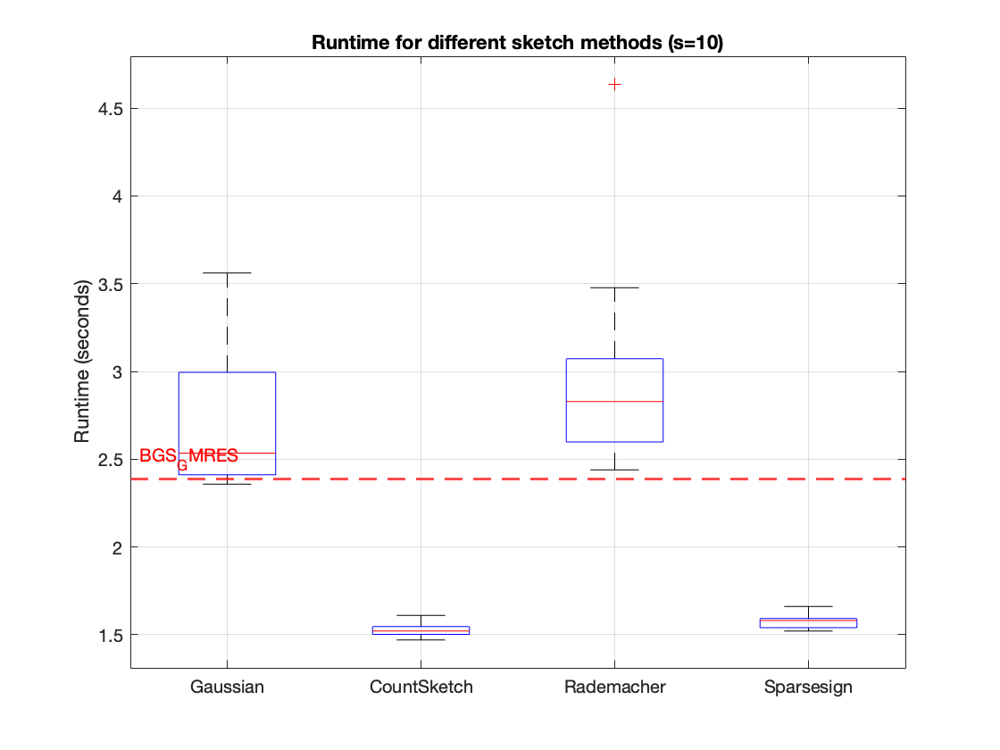

### 2.3 genMatrix(1e3)
**Matrix info:** \( n = 5000 , alpha = 0\)  
**condition number:** \( 1e+03 \)
**Sketch info:** \( m ≈ 1001, d = 2 * m \)  
**Converge info:** \( ctol = 1e-16 \)
**Run** \( runs=1 \)

#### ➤ Same RHS b, only differ in the sketch matrices; more stable, run = 5
- newton
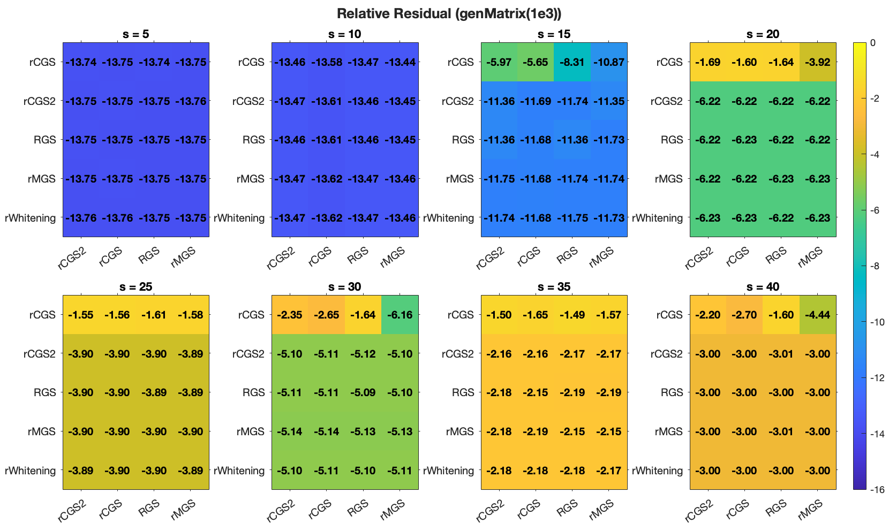  
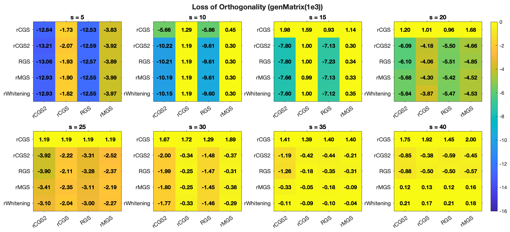  
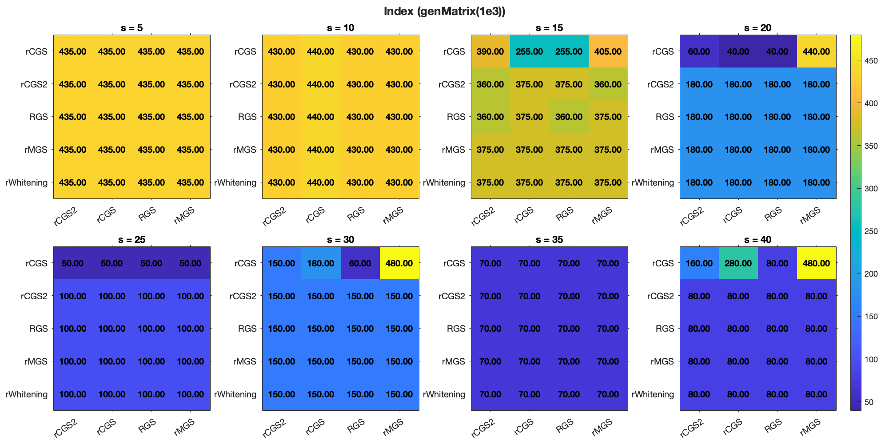

